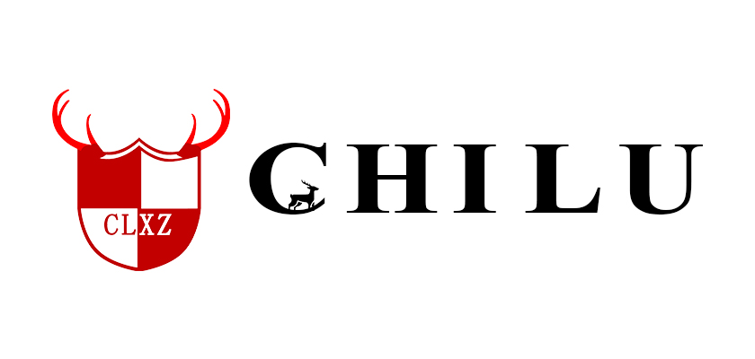

# 赤鹿小组

## 赤鹿来历
赤鹿，属于鹿科的一种。一度濒临灭绝，秉着生态公益保护的想法，故以「赤鹿」命名。不碍于严肃死板，喜欢随性洒脱，故又以「赤鹿小组」为名。

之所以成立「赤鹿小组」，完全兴趣使然，小组成员喜欢捣鼓，喜欢分享，更希望所做的事情能够助人。在助人的同时，也希望所有的读者能够帮助赤鹿小组的编者们纠正错误。赤鹿小组的发起者们发现，要想获得更大的进步，就是不断分享知识，这也是不断鞭策自己向新事物学习的动力之一。

赤鹿小组起初以运维技术，相关运维编程为重点，设计为辅。后期会触及到开发等方面。不敢说能够对于每个人都有所助，只希望当您看到赤鹿的文章，能够有所解决问题思路，于赤鹿小组而言都是莫大的欣慰。当然，要是对您能有真正的帮助，那正是赤鹿的初衷。希望所有读者都能在赤鹿，找到你所找。

## 参与赤鹿
赤鹿小组的每个成员都是赤鹿的作者，更是赤鹿的用户。分享着自己的东西，自己也从参与中受益，更能从读者的反馈中受益；赤鹿小组相信大众的力量，多数人的判断。更相信有您的加入，赤鹿会因您更加的趋向完善。

这是一个好的开始，关于赤鹿，会坚持下去。

## 交流驻扎地
欢迎加入QQ群： 962178796 

